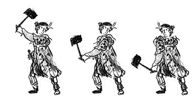

# Ned Ludd Game
## Machines: theme of the game jam
I switched this game from Pixi to Phaser
Was running out of time and spending most of it building the game engine part for Pixi, which I still like and want a lightweight just what I need engine. 
Phaser has a lot built-in, looking forward to using that here.

Notes:
Love this font: https://departuremono.com/
Song: https://www.beepbox.co/#9n31s6k7l00e03t2ma7g0fj07r1i0o432T0v1u11f0qg01d04w1h0E0T1v1u01f10s4q00d03A0F4B4Q5000Pff00E0T0v1u13f10o5q00d03w5h1E0T2v1u15f10w4qw02d03w0E0b4y800000000h8g000000014h000000004h400000000p21kGrhW-mjq_6hmhjhY8eOCGW1GwieW1F8WWMarFOxQ-Ite1sR-244jnZRQOk9v80aqcUhRkkAt97jhihQAtd00

More factoryish:
https://www.beepbox.co/#9n31s0k0l00e04t2ma7g0fj07r1i0o432T0v1u00f0q8111d23w2h0E0T7v1u41f0q011d08H_RJSIrsAArrrrrh0IaE0T1v1uc1f10k8q011d23A1F0B4Q0050Pd66cE262972T2v1u15f10w4qw02d03w0E0b414w0000000h4h000000014h400000004h4w0000000p21xFEY50QD1MxvbOddF7JnmSmniRZx6CTuOA2qWrFN8RM5dvYEdu1bWiY1jhC2egEJEHEL8WGaXF0zRGbHGXXrE4zJHFwmqcOOc0
Ned Ludd, of the Luddites...




---

## Started with: Phaser Vite Template && How to Run, etc. 

This is a Phaser 4 project template that uses Vite for bundling. It supports hot-reloading for quick development workflow and includes scripts to generate production-ready builds.

## Available Commands

| Command | Description |
|---------|-------------|
| `npm install` | Install project dependencies |
| `npm run dev` | Launch a development web server |
| `npm run build` | Create a production build in the `dist` folder |
| `npm run dev-nolog` | Launch a development web server without sending anonymous data (see "About log.js" below) |
| `npm run build-nolog` | Create a production build in the `dist` folder without sending anonymous data (see "About log.js" below) |


## Handling Assets

Vite supports loading assets via JavaScript module `import` statements.

This template provides support for both embedding assets and also loading them from a static folder. To embed an asset, you can import it at the top of the JavaScript file you are using it in:

```js
import logoImg from './assets/logo.png'
```

To load static files such as audio files, videos, etc place them into the `public/assets` folder. Then you can use this path in the Loader calls within Phaser:

```js
preload ()
{
    //  This is an example of an imported bundled image.
    //  Remember to import it at the top of this file
    this.load.image('logo', logoImg);

    //  This is an example of loading a static image
    //  from the public/assets folder:
    this.load.image('background', 'assets/bg.png');
}
```